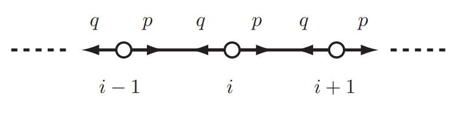
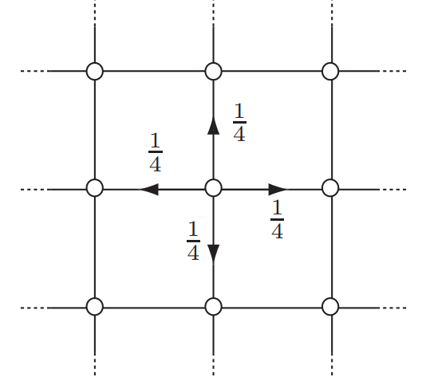
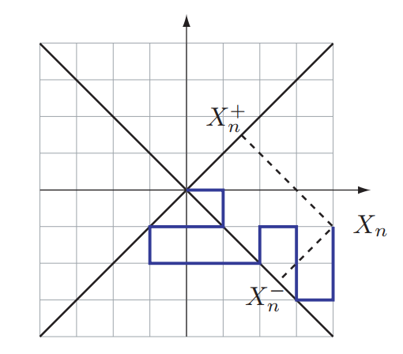
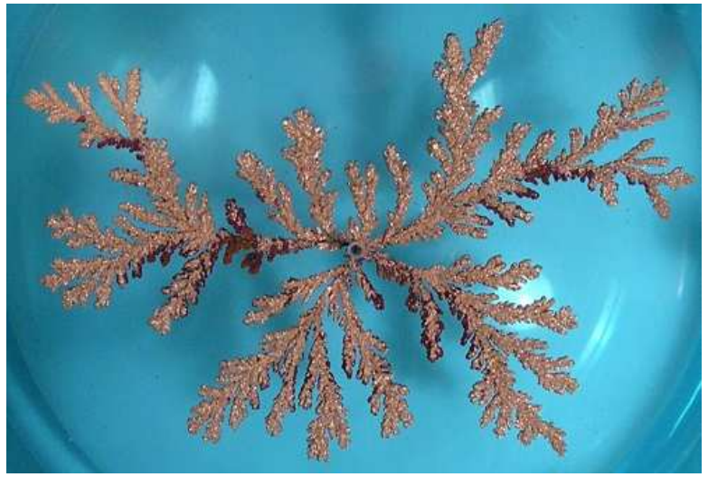

*****

```{r setup, include=FALSE, echo = FALSE}

# Load packages used in this exercise
library(tidyverse)
library(rmarkdown)
library(DT)
```

```{r global_options, include=FALSE}
# Set global options for chunk options
knitr::opts_chunk$set(echo=TRUE, warning=FALSE, message=FALSE, cache=FALSE)
```


# Abstract 

> Two different programs written in Python and optimized with Numba were developed to simulate the growth of a crystal trough DLA (Diffusion-limited aggregation) in two and three dimensions and their fractal dimension was obtained. The approach was through the implementation of random walkers which correspond to a commonly used Markov-Chain Monte Carlo method. 
To ensure the capability of this algorithm, random walkers were also used in computing the solution of different boundary value problems with known analytical solution, namely: the square plate with fixed temperature at its edges, and a disk with one boarder held at a sinusoidal temperature function.
More complex problems were designed and their solutions through the same method were proposed. The results seem to be reasonable, but an experimental test would've been suitable.
Finally, both programs were combined to get a solution for the problem were a crystal was composed of many particles at different temperatures. The final distribution of temperature, along the grid were it was placed, has been gotten. 
From this \textit{computational experiments} it was evident that Monte-Carlo algorithms are surprisingly efficient in the calculation of both deterministic or random processes encountered in nature.

# Introduction
Markov-Chain Monte Carlo simulations, or MCMC for short, are currently one of the top methods for approaching  statistics, econometrics, physics and computing science problems. Specifically, Metropolis algorithm is among the ten algorithms that have had the greatest influence on the development and practice of science and engineering in the 20th century. @andrieu2003introduction.

The heart of a Monte Carlo simulation lies in extracting the solution of a hard mathematical problem, could be statistical or combinatorial for instance, in such a clever way that it converts the problem into a relatively easy task.

MCMC techniques are often applied to solve integration and optimization problems in
large dimensional spaces. @andrieu2003introduction.
Examples where it is commonly used are the following:


* Bayesian statistics: where typically intractable integrals (often with complex or high dimensional integrands) need to be computed in order to obtain  marginal posterior distributions, posterior expectations or calculating the normalizing constant in some expression.\cite{brooks1998markov}
* Statistical mechanics: to compute the partition function Z of a system with states s and Hamiltonian E. @andrieu2003introduction 

* Optimization:to extract the solution that minimizes some
objective function from a large set of feasible solutions. @andrieu2003introduction

Though this are the most common implements, MCMC has also been successful in physics simulations such as neutron diffusion, fluid dynamics, molecular dynamics, machine learning and so on.

We are particularly interested in how to implement random walks,  which are time homogeneous Markov
chains on a countable state space @sunada2012topological, to a series of problems that come out, both, in physics and chemistry. 

The aim of this project was to develop a program able to give results of problems with physical significance, making use of the techniques learned in class. The approach that was taken to embrace this task was the use of random walks, as stated before, to simulate to growth of a crystal and to obtain the solutions of different boundary value problems for the Laplace equation. 

The ultimate goal that was being achieved, was to show that problems with or without analytical solutions can be solved using an ingenious MCMC algorithm. 
	
# Theoretical Background

At this stage it is crucial to define the three key concepts that are the mainstay of this project.
These are: random walks, diffusion limited aggregation and the Laplace equation itself.

A random walk is a stochastic process defined on the points of a lattice. At each time unit the "walker" steps from its present position to one of the other sites of the lattice according to a prescribed random rule. This rule is independent of the history of the walk, and so the process is Markovian.@ben2000diffusion

At each time step the walker hops to one of its nearest-neighbor sites, with equal probability.@ben2000diffusion After n steps the net displacement is:


$$r(n)=\sum_{i=1}^{n} e_i$$

Where $e_i$ is a unit vector that represents the ith step of the walk pointing to a neighbor-site.@ben2000diffusion

As stated by Ben-Avraham et al., for a lattice of space $a$ and step discrete time $t=n\tau$, we can arrive at the following equation $<r^2(t)>=(2d)Dt$ where D, the diffusion constant is given by $a^2/(2d)\tau$. From this it can noticed that the speed of the walker vanishes at long times: $v \sim <r^2>^{(1/2)/t} \sim 1/t(1/2)$.@ben2000diffusion

The mean-square displacement $<r^2>$ can be calculated from the probability density P(r, t), which represents the probability of having displaced at time t, a distance r.@ben2000diffusion.

$$<r^2(n)>=\int r^2P(r, t)d^dr$$

In the one-dimensional case the random walk has the following diagram. 





Where p is the probability of moving to the right, q the probability of moving to the left and they both satisfy the following condition: $0< p=1-q <1$.

If the walker moved m times to the right and t-m times to the left, then the probability density is given by the binomial distribution:

$$p(m, t)=
\left(\begin{array}{c}
      t\\
      m
   \end{array}\right)p^m(1-p)^{t-m}$$
   
For $x<<t$, p=1/2 and using Stirling approximation, we arrive at:

$$P(x, t)dx \simeq \frac{1}{2\pi t}^{1/2}e^-x^2/(2t)dx$$

From this equation it can be pointed out the dependence on time of the random walk. 

Nevertheless, we are going to focus on 2D and 3D random walks. From the figure, at the top right, we can see that the transition probabilities are as follows: 1/4 for each step towards the nearest neighbor (up, down, left or right) and zero in any other case. 

<center>

</center>

$$p_{ij}=\left\{\begin{array}{c}
\text{1/4 if  $|i-j|$=1 }\\
\text{0 otherwise}
\end{array} \right\}$$

After a number n of iterations, one expects to obtain a similar result as the following:



Where $X_n$ is the final position in a new rotated coordinate system y=x. 

It can be proven using Stirling's formula that such walk is recurrent.@cambridge

One of the most appealing simulations there is which makes use of random walkers in 2 dimensions is diffusion-limited aggregation (DLA). It is applicable to aggregation in any system where diffusion is the primary mean of transport in the system. @dirocco. Examples of such things happening in nature are numerous, e.g. electric deposition, river networks, crystal growth, and viscous flow in porous media. Such structures exhibit scale invariance and fractional dimensions as defining features. @glycerol

DLA was originally introduced by Tom Witten and Len Sander as a model for irreversible colloidal aggregation, although they and others quickly realized that the model was very widely applicable. Recent progress in our understanding of DLA has hinged on scaling studies in nonequilibrium statistical physics. Those studies have advanced dramatically in recent years, due in no small part to innovative applications of renormalization group techniques. Yet, many aspects of DLA remain puzzling to specialists.@halsey2000diffusion

DLA gets its name from diffusion = performing random walks, limited = a seed particle is placed at the center and cannot move, and aggregation = a second particle is released and it diffuses until it gets to the seed and sticks next to it. The process repeats several times. 


DLA simulates how a fractal is built from particles in low concentrations. This particles move due to Brownian motion, meet and stick together randomly to form the cluster.@dirocco

The aggregates will grow as long as there are more free surrounding particles. And as it starts forming they will themselves catch more easily the particles so that they cannot reach the inner ones. [PUT REFERENCE TO ARMS]

The most astonishing part is to realize that these structures are quite common in nature. Below are 2 examples:


<figure>

<figcaption>HERE

Figure star involves the injection of a less viscous fluid into a more viscous one in a thin gap between two plates. What one finds in those experiments is pattern formation reminiscent of dendritic structures. @glycerol This phenomenon is known as Hele???Shaw fluid flow.

In a thin cell, or in a porous medium, a fluid???s velocity is proportional to the pressure gradient. 

$$v= -\frac{\kappa}{\mu}\nabla p
\label{velocity}$$


Where $\kappa$ is the permeability in a porous medium and $\mu$ is the viscosity of the fluid. If the fluid is incompressible, then taking the divergence of equation \ref{velocity} yields the Laplace equation:

$$\nabla ^2p=0
\label{laplace}$$

If we injected a second, immiscible fluid of much lower viscosity the result is Hele???Shaw flow. Because of its low viscosity, the injected fluid???s pressure can be set to a constant. Then the flow of the more viscous fluid is determined by equation [PUT REFERENCE TO LAPLACE EQ] with a constant-pressure boundary condition, and its velocity given by [REF TO VERLOCITY] determines the velocity of the interface between the two fluids.@wittendiffusion

In consonance with the equations above, in the case of Hele???Shaw flow, the pressure field satisfies the Laplace equation with constant-pressure boundary conditions, and the velocity of the interface between the two liquids is proportional to the gradient of the pressure. In contrast, for DLA, the probability density of the randomly walking particle satisfies the Laplace equation, with the cluster???s surface providing a surface of constant probability density. Thus DLA is a stochastic version of the Hele???Shaw problem.@wittendiffusion

In colloidal aggregation, the particles diffuse, while in Hele???Shaw flow, the fluid???s pressure diffuses. In each case, the growth of the interface is sufficiently slow that we can use the Laplace equation rather than the diffusion equation to model the diffusing field.@wittendiffusion

This suggests that the Laplacian model might be useful for general pattern formation problems in which diffusive transport controls the growth of a structure. 
And indeed, DLA has been used to model phenomena as electrodeposition, surface poisoning in ionbeam microscopy, and dielectric breakdown @wittendiffusion. See figure \ref{diamond} which is a mineralogical example.


### Expected outputs of the project


<!-- |Output #|Digital Output|Type|Format,Duration,Size|Planned access| -->
<!-- |:------:|:-------|:-----------|:----------|:-------------| -->
<!-- |1|doaj_seal.csv|raw data set downloaded from DOAJ site| CSV file, plain text format, 2.7 MB   | Not retained since duplicative  | -->
<!-- |2| doaj_seal_enhanced.csv | enhanced data set with new data | CSV file, plain text format, 2.7 MB   | GitHub repository; Zenodo repository  | -->
<!-- |3| Data set documentation | json metadata file | plain text file, .1 MB | Datacite registry database; GitHub public repository; Zenodo repository | -->
<!-- |4| Data Processing steps  | R scripts and comments | R Notebook file, 1 MB | GitHub public repository | -->
<!-- |5| Data Visualizations  | R scripts and documentation; Plots | R Notebook file, .png image files 4 MB | GitHub public repository | -->
<!-- |6| Journal article | Rendered report | RMarkdown, 9 MB| Publisher website,   community preprint server| -->


# References
